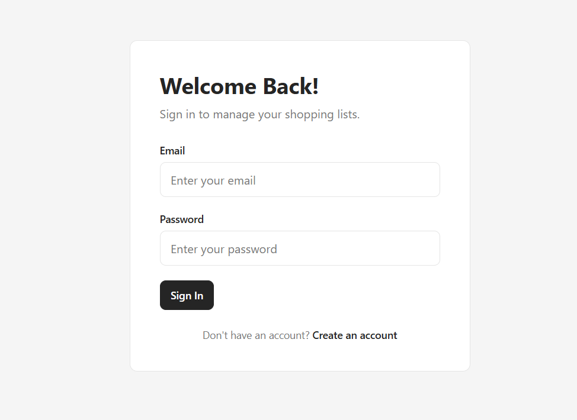
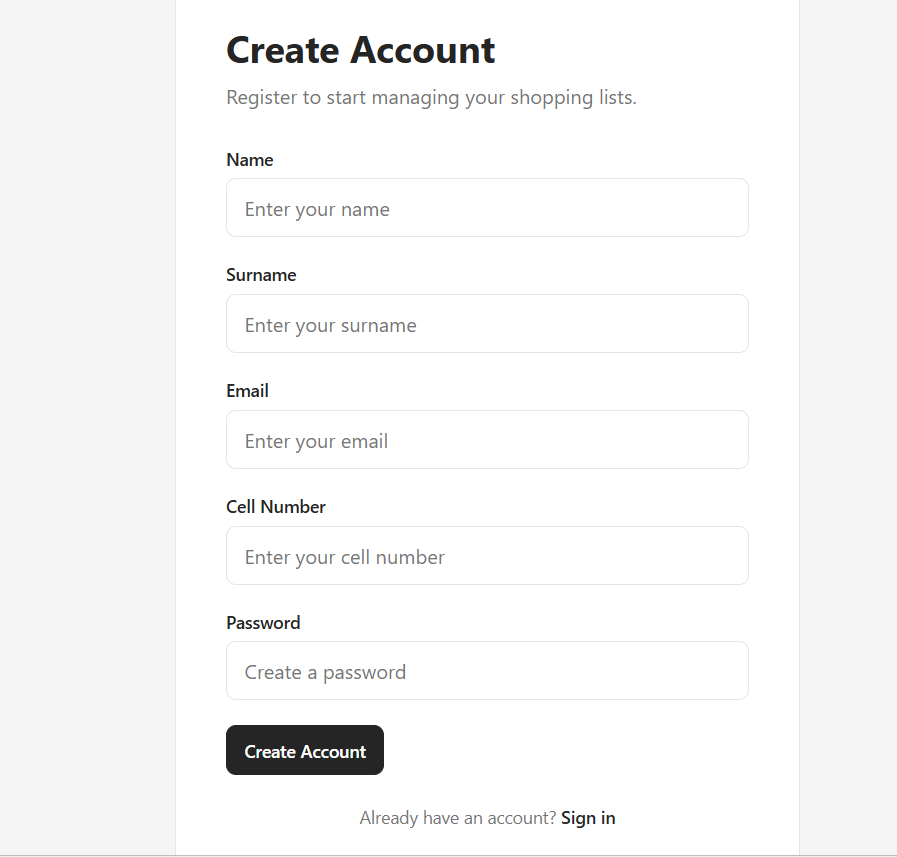
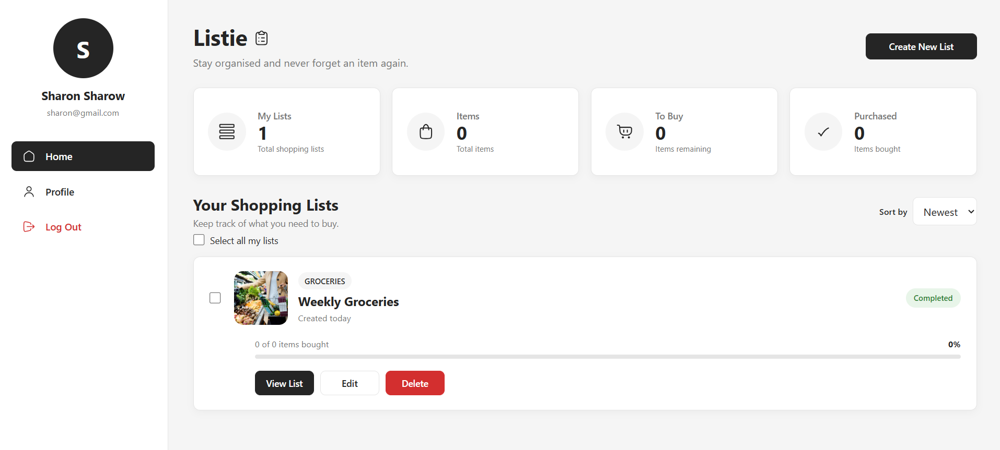
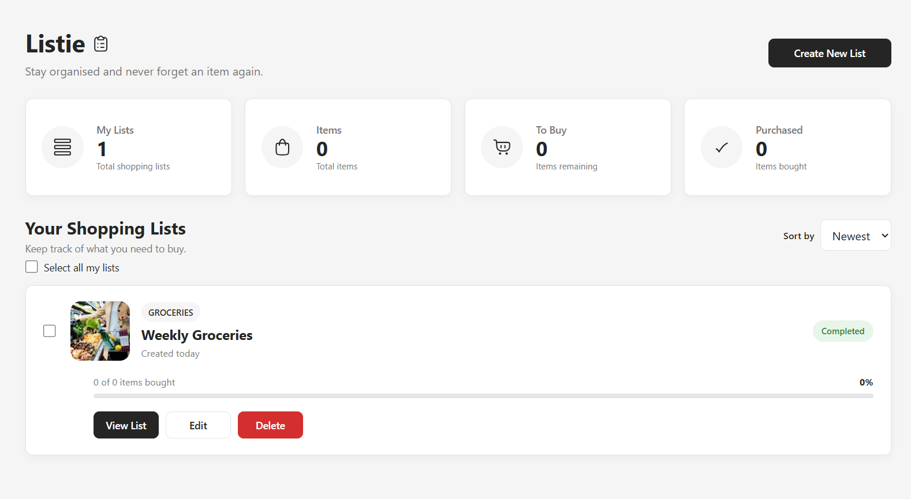
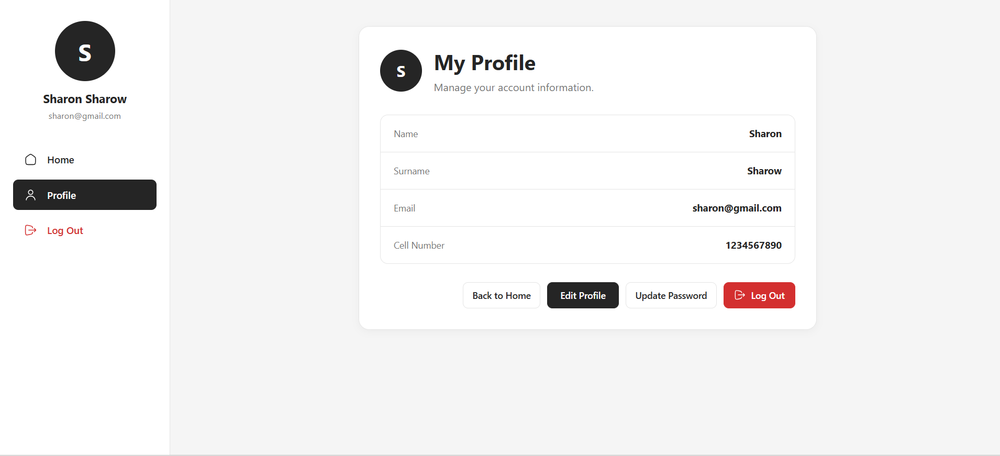

# The Shopping List App

This is my **Shopping List App**, a modern shopping list management application designed to help users create, organize, and track their shopping lists and individual shopping items.

The application was built using **React**, **TypeScript**, and **Vite**, with a focus on Redux Toolkit state management, API integration, user authentication, protected routing, responsive design, reusable components, form validation, password hashing, and a smooth user experience.

The application uses **json-server** as a REST API and database for persistent application data.

---

# Overview

## The Challenge

Users should be able to:

* Create an account
* Log in using their email and password
* Have their password securely hashed during registration
* Access protected pages after logging in
* Create different shopping lists
* Assign categories to shopping lists
* Add notes to shopping lists
* View all their shopping lists
* Sort shopping lists by newest, oldest, or name
* Open a shopping list
* Edit shopping lists
* Delete shopping lists
* Add shopping items to a shopping list
* Specify the quantity of each shopping item
* Assign categories to shopping items
* Mark shopping items as completed
* Edit shopping items
* Delete shopping items
* Search for shopping items
* Sort shopping items
* View their profile information
* Update their profile information
* Update their login credentials
* Update their password using a PATCH request
* Log out of their account
* Receive toast notifications instead of browser/system alerts
* Receive confirmation dialogs for destructive actions
* Navigate between application pages using React Router
* Use the application across desktop, tablet, and mobile screen sizes

---

# Preview

## Login Page



## Registration Page



## Home Page



## Shopping List



## Profile



---

# Links

* **Solution URL:** [GitHub Repository](https://github.com/Sharon-Mashai/Shopping-List.git)
* **Live Site URL:** [Shopping List App](https://shopping-list-nu-hazel.vercel.app/)

---

# Getting Started

Follow these instructions to run the project locally.

## Prerequisites

Before you begin, ensure you have the following installed:

* Node.js v18 or later recommended
* npm, which comes with Node.js

You can verify your installation by running:

```bash
node -v
npm -v
```

---

# Installation

## 1. Clone the Repository

```bash
git clone https://github.com/Sharon-Mashai/Shopping-List.git
```

## 2. Navigate to the Project Directory

```bash
cd Shopping-List
```

## 3. Install Dependencies

```bash
npm install
```

---

# Running the Application

The application uses both **Vite** and **json-server**.

The React application runs on the Vite development server while json-server provides the REST API used for users, shopping lists, and shopping items.

## Start the JSON Server

Run:

```bash
npm run server
```

The JSON server will run on:

```text
http://localhost:3000
```

## Start the React Application

In another terminal, run:

```bash
npm run dev
```

Vite will start the application and display something similar to:

```text
Local: http://localhost:5173/
```

Open the URL in your browser to view the application.

The project supports **Hot Module Replacement (HMR)**, meaning changes made during development are reflected in the browser without requiring a full page refresh.

---

# Building for Production

To generate an optimized production build, run:

```bash
npm run build
```

The compiled application will be generated inside the **dist** folder.

---

# Previewing the Production Build

To preview the production build locally:

```bash
npm run preview
```

---

# My Process

## Built With

* React
* TypeScript
* Vite
* Redux Toolkit
* React Redux
* React Router
* json-server
* bcryptjs
* Hugeicons React Library
* CSS3
* Flexbox
* Responsive Design
* REST API
* Component-Based Architecture
* Custom React Hooks
* Toast Notifications
* Protected Routes
* Form Validation

---

# Features

## User Registration

Users can create an account by providing:

* Name
* Surname
* Email
* Cell number
* Password

Before registration is completed, the application validates that all required fields have been completed.

The application also checks whether the email address already exists.

This prevents multiple accounts from being registered using the same email address.

---

## Password Hashing

Passwords are not stored as plain text.

During registration, the password is hashed using **bcryptjs** before it is sent to json-server.

Example:

```typescript
const passwordHash = await bcrypt.hash(
  password,
  10,
);
```

The hashed password is then stored in the user record.

This means the original password is not stored directly in the database.

---

## Login Authentication

Users must enter their:

* Email
* Password

when logging in.

The application retrieves the user account using the provided email address and then compares the entered password against the stored bcrypt hash.

Example:

```typescript
const passwordMatches =
  await bcrypt.compare(
    password,
    user.password,
  );
```

If the password matches, the user is logged into the application.

The login form does not automatically populate or remember the user's email and password.

---

# Authorization and Protected Routes

The application uses protected routing to prevent unauthenticated users from accessing private pages.

Protected pages include:

* Home
* Shopping List
* Create Shopping List
* Edit Shopping List
* Profile
* Update Login Credentials

Users who are not logged in are redirected to the login page.

Public routes are used for:

* Login
* Registration

This separates public authentication pages from protected application pages.

---

# Shopping Lists

Users can create and manage multiple shopping lists.

Each shopping list contains information such as:

* List name
* Category
* Notes
* Creation date
* User ID

Shopping lists are associated with the currently logged-in user.

This allows each user to view their own shopping lists.

---

## Creating a Shopping List

Users can create a new shopping list by providing:

* List name
* Category
* Notes

When the list is created, it is sent to the json-server API using a `POST` request.

```http
POST /shoppingLists
```

The newly created shopping list is then added to the Redux store.

---

## Viewing Shopping Lists

The Home page retrieves the shopping lists belonging to the currently logged-in user.

The lists can be sorted by:

* Newest
* Oldest
* Name

The Home page also provides clear empty, loading, and error states.

---

## Editing Shopping Lists

Users can edit an existing shopping list.

The application retrieves the selected list using its ID and allows the user to update:

* List name
* Category
* Notes

The updated information is saved using a `PATCH` request.

```http
PATCH /shoppingLists/:id
```

The Redux store is then updated with the saved shopping list.

---

## Deleting Shopping Lists

Users can delete shopping lists they no longer need.

Before deletion, the application displays a confirmation dialog to help prevent accidental deletion.

The shopping list is removed from the API using:

```http
DELETE /shoppingLists/:id
```

The Redux store is then updated to remove the deleted list.

---

# Shopping Items

Each shopping list can contain multiple shopping items.

Shopping items include:

* Item name
* Quantity
* Category
* Completion status
* Creation date
* Shopping list ID

---

## Adding Shopping Items

Users can add items to an existing shopping list.

For example:

```text
Item Name: Milk
Quantity: 2
Category: Dairy
```

The item is created using a `POST` request:

```http
POST /shoppingItems
```

The newly created item is then added to the Redux store.

---

## Editing Shopping Items

Users can edit existing shopping items.

They can update:

* Item name
* Quantity
* Category

The updated item is saved using:

```http
PATCH /shoppingItems/:id
```

---

## Completing Shopping Items

Users can mark an item as completed using a checkbox.

The completion state is stored in the API.

For example:

```typescript
const updatedItem = {
  ...item,
  completed: !item.completed,
};
```

The updated item is then sent to the API using a PATCH request.

Completed items are visually distinguished from pending items.

---

## Deleting Shopping Items

Users can delete individual shopping items.

A confirmation dialog is displayed before deletion.

The item is then removed using:

```http
DELETE /shoppingItems/:id
```

The Redux store is updated after the API request succeeds.

---

# Searching and Sorting

The Shopping List page allows users to search through their shopping items.

Users can search by:

* Item name
* Category

Shopping items can also be sorted by:

* Newest
* Oldest
* Name
* Category
* Completed status

This makes it easier to manage larger shopping lists.

---

# Profile Management

Users can access their profile page after logging in.

The profile displays:

* Name
* Surname
* Email
* Cell number

Users can update their personal information.

Profile updates are sent to the API using a PATCH request:

```http
PATCH /users/:id
```

The Redux authentication state is updated after the profile is successfully saved.

---

# Login Credentials

The application provides a separate page for managing login credentials.

Users can access this section from their Profile page instead of having the credential form displayed immediately.

This keeps the Profile page clean and makes sensitive account settings easier to manage.

Users can update their password by providing the required password information.

The new password is hashed using bcrypt before being stored.

The updated credentials are saved using a PATCH request:

```http
PATCH /users/:id
```

---

# Logout

Users can log out from their Profile page.

Before logging out, the application displays a confirmation modal.

After confirmation:

```text
User confirms logout
        ↓
Redux authentication state is cleared
        ↓
User is redirected to /login
```

The user must enter their email and password again when logging back in.

---

# Redux State Management

The application uses **Redux Toolkit** for global state management.

Redux Toolkit is used instead of classic Redux because it provides a simpler and more modern approach to managing Redux state.

The application contains separate slices for different areas of application state.

Examples include:

* Authentication state
* Shopping list state
* Shopping item state

---

# Authentication Slice

The authentication slice manages the currently logged-in user.

The state includes:

```typescript
interface AuthState {
  user: User | null;
  isLoggedIn: boolean;
}
```

The authentication slice provides actions such as:

```text
login()
updateUser()
logout()
```

When a user logs in, their basic account information is stored in Redux.

When the user logs out, the authentication state is cleared.

---

# Shopping List Slice

The shopping list slice manages shopping lists within Redux.

It provides actions such as:

```text
setShoppingLists()
addShoppingList()
updateShoppingList()
deleteShoppingList()
setLoading()
setError()
```

This allows the UI to immediately reflect changes after API operations.

---

# Shopping Items Slice

The shopping item slice manages the items belonging to the selected shopping list.

The state includes:

* Shopping items
* Loading state
* Error state

Actions are used to:

* Set items
* Add items
* Update items
* Delete items
* Set loading state
* Set error state

---

# API Integration

The application separates API requests into an `api.ts` service file.

This keeps API logic separate from the UI components.

The API service handles operations for:

## Users

```http
GET /users/:id
PATCH /users/:id
```

## Shopping Lists

```http
GET /shoppingLists
GET /shoppingLists/:id
POST /shoppingLists
PATCH /shoppingLists/:id
DELETE /shoppingLists/:id
```

## Shopping Items

```http
GET /shoppingItems
GET /shoppingItems/:id
POST /shoppingItems
PATCH /shoppingItems/:id
DELETE /shoppingItems/:id
```

This structure makes the application easier to maintain and keeps components focused on UI and application logic.

---

# json-server

The application uses **json-server** as a lightweight REST API for persistent data.

The main data collections are:

```text
users
shoppingLists
shoppingItems
```

The data is stored in:

```text
db.json
```

json-server automatically provides REST endpoints for these collections.

---

# Toast Notifications

The application uses custom toast notifications instead of relying on browser/system alerts for normal user feedback.

Toast notifications are used for actions such as:

* Successful registration
* Login success
* Invalid login credentials
* Profile updates
* Shopping list creation
* Shopping list updates
* Shopping item updates
* Failed API operations

The application uses different toast types:

* Success
* Error
* Warning
* Information

This provides immediate visual feedback without interrupting the user's workflow.

---

# Confirmation Modals

Destructive actions such as deleting shopping lists, deleting shopping items, and logging out use confirmation dialogs or custom confirmation modals.

For example:

```text
User clicks Delete
        ↓
Confirmation modal appears
        ↓
User confirms
        ↓
API request is sent
        ↓
Redux state is updated
```

This helps prevent accidental actions.

---

# Hugeicons

The application uses **Hugeicons** for interface icons.

Icons are used instead of emojis throughout the application.

Examples include icons for:

* Logout
* Alerts
* Shopping
* Actions
* Navigation
* User interface elements

This provides a more consistent visual style across the application.

---

# Responsive Design

The application is designed to work across different screen sizes.

The interface supports:

* Desktop
* Tablet
* Mobile

Responsive CSS is used to adjust layouts, forms, buttons, cards, navigation, and shopping item displays based on the available screen width.

The goal is to ensure that the application remains easy to use regardless of the device being used.

---

# Loading and Error Handling

The application provides feedback while API requests are being processed.

Examples include:

```text
Loading shopping lists...
```

```text
Loading shopping items...
```

```text
Saving...
```

```text
Deleting...
```

Error messages are displayed when API requests fail.

For example:

```text
Unable to load shopping lists.
```

```text
Unable to create shopping list.
```

```text
Unable to update shopping item.
```

This provides users with clear feedback instead of leaving the interface in an unknown state.

---

# Application Data Flow

The application follows a simple data flow:

```text
User logs in
        ↓
Authentication is verified
        ↓
User information is stored in Redux
        ↓
Protected routes become accessible
        ↓
Shopping lists are loaded from json-server
        ↓
Shopping lists are stored in Redux
        ↓
User creates or selects a shopping list
        ↓
Shopping items are loaded
        ↓
User can add, edit, complete, search,
sort, or delete shopping items
        ↓
Changes are sent to json-server
        ↓
Redux state is updated
        ↓
UI reflects the latest state
```

---

# Authentication Flow

The login process follows this flow:

```text
User enters email and password
        ↓
Application searches for the email
        ↓
User account is retrieved
        ↓
bcrypt compares the entered password
with the stored password hash
        ↓
Password matches
        ↓
User is authenticated
        ↓
User information is stored in Redux
        ↓
User is redirected to Home
```

For an invalid login:

```text
User enters credentials
        ↓
Email or password is incorrect
        ↓
Authentication fails
        ↓
Error toast is displayed
        ↓
User remains on Login
```

---

# Registration Flow

The registration process follows this flow:

```text
User completes registration form
        ↓
Form validation
        ↓
Check whether email already exists
        ↓
Hash password using bcrypt
        ↓
Create user through API
        ↓
User is stored in json-server
        ↓
Success toast is displayed
        ↓
User can log in
```

---

# Shopping List Data Flow

```text
User clicks Create List
        ↓
Create Shopping List page opens
        ↓
User enters list information
        ↓
Form validation
        ↓
POST request to json-server
        ↓
Shopping list is created
        ↓
Redux store is updated
        ↓
User returns to Home
```

---

# Shopping Item Data Flow

```text
User opens a shopping list
        ↓
Shopping list information is loaded
        ↓
Shopping items are retrieved
        ↓
Items are stored in Redux
        ↓
User adds an item
        ↓
POST request is sent
        ↓
New item is added to Redux
        ↓
UI updates automatically
```

---

---

# What I Learned

While working on this project, I learned how to:

* Build a complete shopping list application using React and TypeScript
* Use Vite to develop and build a React application
* Manage global state using Redux Toolkit
* Understand Redux slices and reducers
* Connect a React application to a REST API
* Use json-server as a lightweight backend
* Perform GET, POST, PATCH, and DELETE requests
* Separate API logic from UI components
* Implement user registration and authentication
* Hash passwords using bcrypt
* Compare passwords against stored bcrypt hashes
* Prevent duplicate email registration
* Implement protected and public routes
* Work with React Router
* Create reusable custom hooks
* Implement toast notifications
* Create confirmation modals
* Handle loading and error states
* Implement shopping list CRUD functionality
* Implement shopping item CRUD functionality
* Implement search and sorting
* Update user profile information
* Update login credentials using PATCH requests
* Create responsive layouts
* Use TypeScript interfaces for application data
* Use Hugeicons instead of emojis for interface icons
* Structure a React project using reusable services, pages, components, hooks, and Redux slices

---

# Security Considerations

The application uses **bcryptjs** to hash user passwords before storing them.

Passwords are therefore not stored as plain text in `db.json`.

During login, bcrypt compares the entered password with the stored hash.

However, because this project uses **json-server and a client-side React application**, it is intended as an educational project rather than a production authentication system.

A production application would require a proper backend authentication system where password hashing and authentication are performed securely on the server.

---

# API Endpoints

## Users

### Get User

```http
GET /users/:id
```

### Update User

```http
PATCH /users/:id
```

---

## Shopping Lists

### Get Shopping Lists

```http
GET /shoppingLists
```

### Get Shopping List

```http
GET /shoppingLists/:id
```

### Create Shopping List

```http
POST /shoppingLists
```

### Update Shopping List

```http
PATCH /shoppingLists/:id
```

### Delete Shopping List

```http
DELETE /shoppingLists/:id
```

---

## Shopping Items

### Get Shopping Items

```http
GET /shoppingItems
```

### Get Shopping Item

```http
GET /shoppingItems/:id
```

### Create Shopping Item

```http
POST /shoppingItems
```

### Update Shopping Item

```http
PATCH /shoppingItems/:id
```

### Delete Shopping Item

```http
DELETE /shoppingItems/:id
```

---

# Continued Development

In future versions of the application, I would like to improve my skills and expand the application with:

* Improved authentication and authorization
* Server-side authentication
* JWT-based authentication
* Better password recovery functionality
* More advanced account security
* Shopping list sharing
* Collaborative shopping lists
* Shopping list images
* Shopping item images
* More advanced filtering
* Drag-and-drop item organisation
* Shopping list templates
* Item quantity controls
* Price tracking
* Shopping budget management
* Total shopping cost calculations
* Better accessibility support
* Unit and integration testing
* Progressive Web App (PWA) support
* Improved offline capabilities
* Performance optimizations

---

# Useful Resources

* [React Documentation](https://react.dev)
* [TypeScript Handbook](https://www.typescriptlang.org/docs/)
* [Vite Documentation](https://vite.dev)
* [Redux Toolkit Documentation](https://redux-toolkit.js.org/)
* [React Router Documentation](https://reactrouter.com/)
* [json-server](https://github.com/typicode/json-server)
* [bcryptjs](https://github.com/dcodeIO/bcrypt.js)
* [Hugeicons](https://hugeicons.com)
* [MDN Web Docs](https://developer.mozilla.org)

---

# Author

**Sharon Mashai**

* GitHub: [Sharon-Mashai](https://github.com/Sharon-Mashai)

---

# Acknowledgments

Special thanks to **Mentors and Facilitator** for providing practical front-end development challenges that encourage developers to strengthen their React, TypeScript, Redux, API integration, responsive design, authentication, and UI development skills.

This project provided an opportunity to apply these concepts to a practical shopping list application while learning how to manage global application state using **Redux Toolkit**, communicate with a REST API using **json-server**, implement authentication and password hashing using **bcryptjs**, and create a responsive and user-friendly interface.
